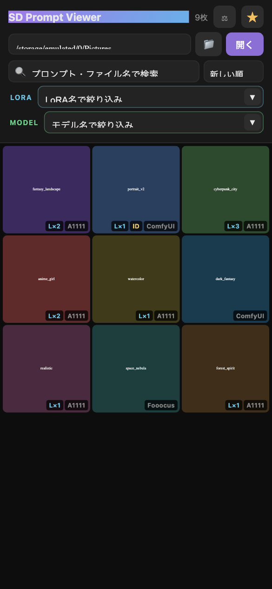
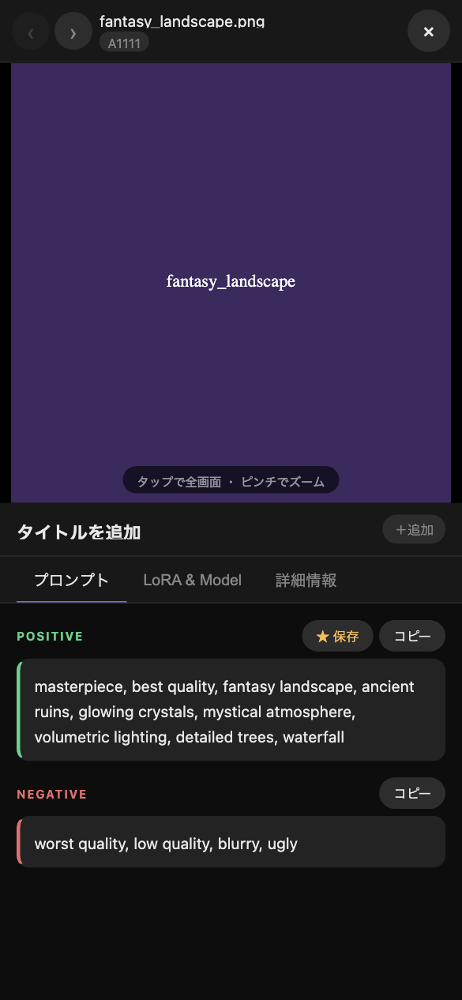
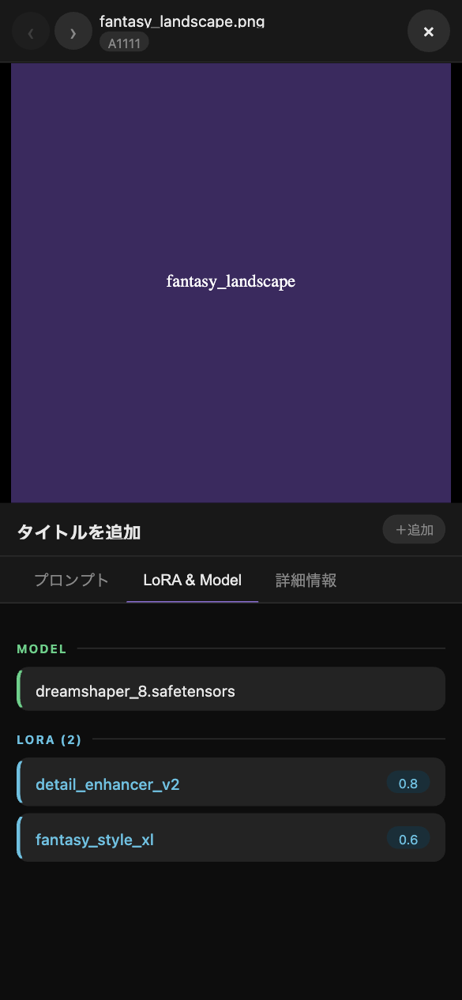
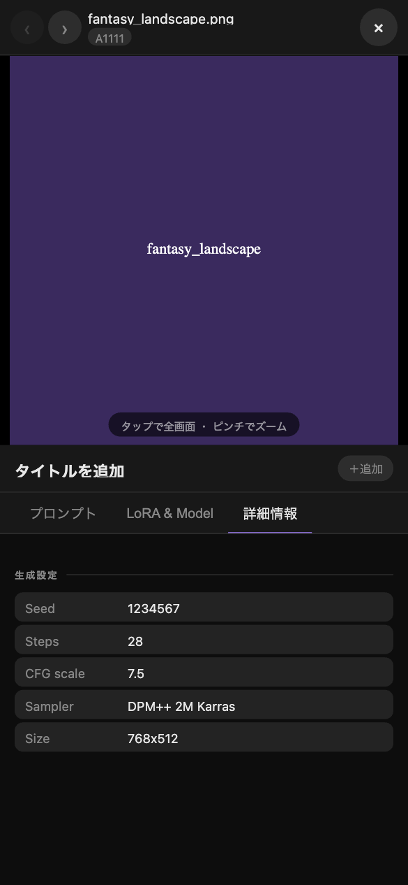
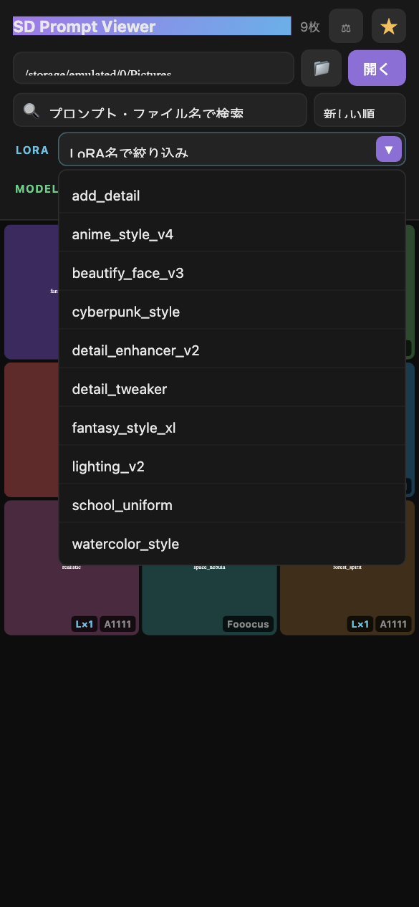

# SD Prompt Viewer

Stable Diffusion で生成した画像に埋め込まれたメタデータ（プロンプト・LoRA・InstantID・設定値）を閲覧できる Android アプリです。

## スクリーンショット

<table>
  <tr>
    <td align="center"><b>ギャラリー</b></td>
    <td align="center"><b>プロンプト</b></td>
    <td align="center"><b>LoRA & Model</b></td>
  </tr>
  <tr>
    <td></td>
    <td></td>
    <td></td>
  </tr>
  <tr>
    <td align="center"><b>詳細情報</b></td>
    <td align="center"><b>LoRA フィルター</b></td>
    <td align="center"></td>
  </tr>
  <tr>
    <td></td>
    <td></td>
    <td></td>
  </tr>
</table>

## ダウンロード

[Releases](../../releases/latest) ページから最新の `app-debug.apk` をダウンロードしてインストールできます。

## 機能

- **ギャラリー表示** — 任意のフォルダを指定して画像一覧を表示。隠しフォルダ（`.` 始まり）も読み込み可能
- **オフライン処理** — PNG tEXtチャンク / JPEG EXIF を端末上で直接解析。通信なし、画像のアップロードなし
- **画像ビュー** — タップで真の全画面・ピンチ/ダブルタップでズーム・横スワイプで前後の画像へ移動
- **タイトル / 説明文** — 画像ごとに自由なメモを付与可能（端末内に保存）
- **プロンプト表示** — Positive / Negative をワンタップでコピー、お気に入りセットとして保存も可
- **2枚比較** — 異なる画像のプロンプト差分（一致しないトークン）をハイライト表示
- **絞り込み** — プロンプト全文検索 / LoRA・モデル候補からのオートコンプリート
- **ソート** — 新しい順 / 古い順 / 名前 / 形式 / ランダム
- **LoRA & Model 情報** — プロンプトテキストおよび ComfyUI ノードから name / weight を抽出
- **詳細情報** — Seed、Steps、CFG scale、Sampler、InstantID 検出など
- **Android 戻るボタン対応** — オーバーレイを順に閉じ、最後は端末ホームへ（アプリは閉じない）

## 対応フォーマット

| フォーマット | PNG | JPEG |
|---|---|---|
| Automatic1111 (A1111) | ✅ | ✅ |
| ComfyUI | ✅ | — |
| Fooocus | ✅ | — |
| InvokeAI | ✅ | — |
| StableSwarmUI | ✅ | — |

## 動作環境

- Android 8.0 (API 26) 以上
- ストレージ権限（すべてのファイルへのアクセス） — 隠しフォルダの読み込みに必要

## ビルド方法

1. **Android Studio**（Meerkat 2024.3 以降推奨）でプロジェクトを開く
2. **Build → Generate App Bundles or APKs → Build APK(s)**
3. `app/build/outputs/apk/debug/app-debug.apk` を端末にインストール

## 仕組み

`WebView` + `JavascriptInterface` ブリッジにより、Android ネイティブのファイルシステム層と純粋な JS メタデータパーサーを組み合わせています。PNG チャンクと JPEG EXIF データをネイティブ側で読み取り Base64 で JS 層に渡すことで、外部依存なしに解析を完結しています。画像は `shouldInterceptRequest` でインターセプトした独自スキーム `localfile://` 経由で WebView に提供されます。

## プライバシー

すべての処理は端末上でのみ行われます。画像・メタデータが外部サーバーに送信されることは一切ありません。

## ライセンス

MIT
